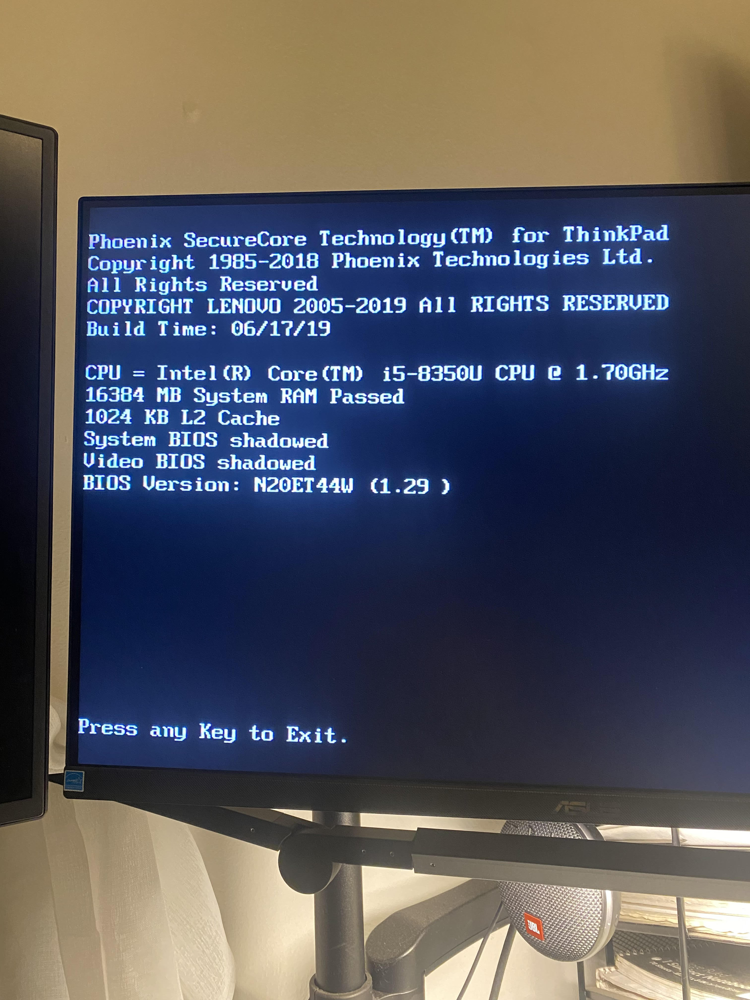

# COMP160: Algorithms, Fall 2021 Project #
Joel Alonzo

---

## What did I build? ##
My initial proposal given in Homework 5 was to build out **COUNTINGSORT** and **RADIXSORT**. This is because I have spent time previously building out other sorting algorithms (MERGE, INSERTION, BUBBLE, etc.).
This is also because one uses the other, so building a functional COUNTINGSORT could be modularized and used for the following RADIXSORT code. As of now, this is still the plan.
If time allows, I would like to try the following:
1. [NOT COMPLETED] Implement another sorting algorithm. Compare runtimes of one to both COUNTING and RADIX SORTs. Vary the input data.
2. [COMPLETED] Possibly give the user (you) the ability, via the command line, to put bounds on input for the sorting algorithms. In my head, it asks for a number-range which will be randomized, frequency of numbers in a the given range, and (if time allows) which algorithm to direct the input too, default being all 3.
3. [Not Completed] If I end up coding this much quicker than I believe it will take me, provide some visual-based output comparing the three sorting algorithms over different integer ranges.
4. {Definitely not completed] God willing, my dream would be too do real-time data visualizations.  [This video](https://www.youtube.com/watch?v=T3C8nPm9mV4) is great (head's up: seizure warning) but I was thinking something both more visually pleasant and also without the audio which can, at times, mimic the sound of madness.

If I manage to get to all of these we will see, if I remember, I will try to update the above list with what is actually available when I complete the documentation below. List above has been updated.

This, as you will quickly notice, is written using **PYTHON**.  

## How do I run this? ##
You should have two documents of importance in this volume:
1. This README (Hi, nice to have you here.)
2. main.py

There are some image files, but ignore those, you'll see those below on this page.

This was built using **Python 3.10.0** and to run:  
<code align="center">py main.py</code>

I have included a fairly inclusive walkthrough offering options to run both RADIX and COUNTING SORT using a variety of input types. It will all be output to the console.  
<h5 align="center"> TO BE CLEAR, YOU WILL NEED TO INTERACT WITH THE PROGRAM VIA THE CONSOLE FOR ANYTHING TO HAPPEN. </h5>  
I have tried to catch any problem that may be input in this way so, unless you are going out of your way to break the program, you should be fine. If you do manage to break it, I would be interested in how you did so. It's possibly not that hard.  
There is an 'easy' option for both algorithms if you don't want to interact with the console too much. Simply type 'N' when prompted and a randomized input list will be built, run and results returned.
  

[Github for this project if needed.](https://github.com/programja/comp160_project)

## What tests did I run? ##
Several and repeatedly. There are times when I came across issues which boiled down to:
1. Getting lost in indexes, placing indexes in correct spaces requeired repeated re-testing.
2. Python's 'random' module isn't, well, super great. I was able to eventually randomize all input lists but this took longer than expected and has been tested to completion.
3. I ran every version of right/wrong and correct/incorrect inputs into both algorithms. Barring your computing power, these two should be able to handle quite a lot. My personal PC on the other hand, crashed with an overheat warning on running RADIXSORT on 50 elements. (see below)
4. Since this is a command-line interface process, I attempted to catch all possible entries as to (a) hide some Easter Eggs and (b) I'm a quality engineer so reinforcing poor code is what I am decently good at. Exception netting.

## What conclusions were drawn? ##
Working my way around Python, which I am not super-versed in definitely took a minute. It's lack of types always takes a second to re-adjust to.  
Lists are, for the most part, decent in working with mathematical operations. I do not think this would be applicable for very large data sets but for this they appear to work well.  
I build a functioning COUNTINGSORT, tested and once ready, was eager to use it in the implementation of RADIXSORT. Half of the work is already done was the general thought. This is not the case. After trying to 'fit' my COUNTINGSORT into a more extensive RADIXSORT, I gave up and created a MODIFIED COUNTINGSORT that helped the RADIX method remain small-ish while adding the notion of 'place values' to COUNTINGSORT itself, which incredibly streamlined the process.  
I really would like to see a visualization (other than the chaotic youtube screech fests) of algorithms that sort. Possibly given in a slower way so that it is simpler to grasp what the algorithm is doing at the very least. As a visual learner this would definitely have helped me.  
I make fun of Python but it's not that bad. Especially when working up just a script.  
Finally, for a majority of the test cases I tried to implement a timer in hopes of being able to report execution time of certain algorithms. This proved difficult, especially as my computer began to overheat. I even tried running the given input list through the algorithm 100 times, generating a non-zero execution time but dividing this number by 100 did not provide the 'average' runtime of the given algorithm—it generated 0.0. This could be useful if I had more computational power or a graphic card to handle large sorting calls. i.e. to prove the running times given in class. On the other hand, perhaps there is a module that can keep track of millionths of a fraction of a second that I am unaware of.

## What did I learn during this entire process? ##
1. Implementing these algorithms forced me to be nose-down on indexes and pointers in relations to how, esp. COUNTINGSORT, manages its temporary count array, then creating its CUMULATIVE array. It took a second but I managed to figure it out.
2. A central repo or possible API (which more than likely already exists) would be a fun project. Sending HTTPS CRUD calls with a body or URL containing sorting data. This would be great to compare all sorting algorithms to one another per specific inputs.
3. Not to be rude, but building things is so much more interesting and fun than learning about the theory behind them The theory is incredibly important but it is only once I start building the algorithm or data structure that my mind begins looking at ways to make it quicker.  
(i.e. RADIXSORT assumes that the given place list running through COUNTINGSORT has 10 possible values every time. This is not the case, as there could be a list based on the ones, tens, one-hundreds, etc. place that does not extend all the way to 9 or all the way down to 0. We can take a max of not the input list but of individual place lists to remove unneeded elements (re-translating the 0-index of a list that starts at element 4 would take some magic though). This would help reduce runtime, probably not by much, but be able to reduce the amount of 0 count iterations being added in the count and cumulative processes.)
4. I really like helping set up interfaces (not web interfaces) that help people better understand processes and explaining things in a way that they may possibly understand.
5. COUNTINGSORT is fast but good Lord RADIXSORT is impressive.
6. I should have used my System76 Linux machine and a simple RADIXSORT of 50 elements can crash my computer 15 minutes before the deadline:

